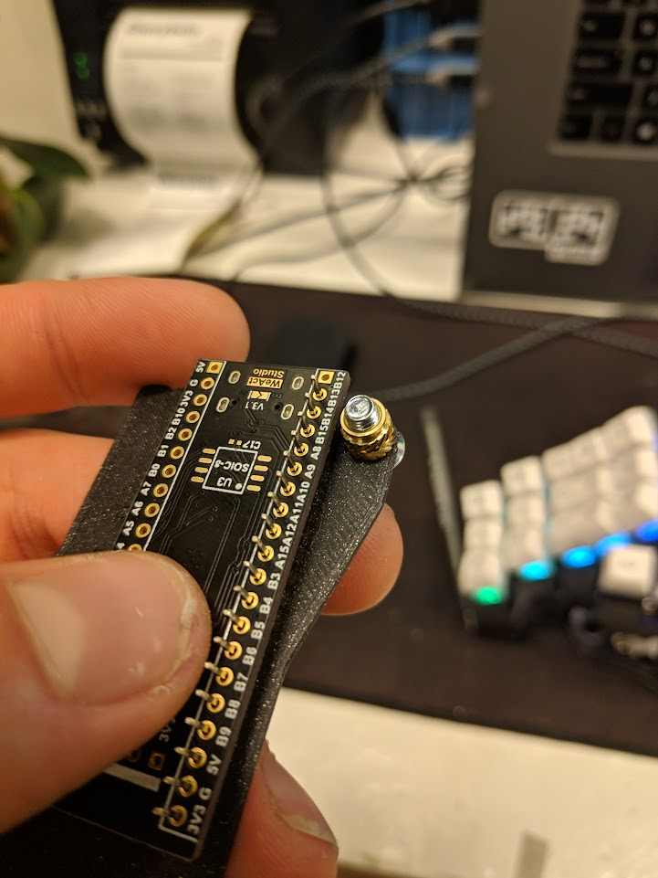
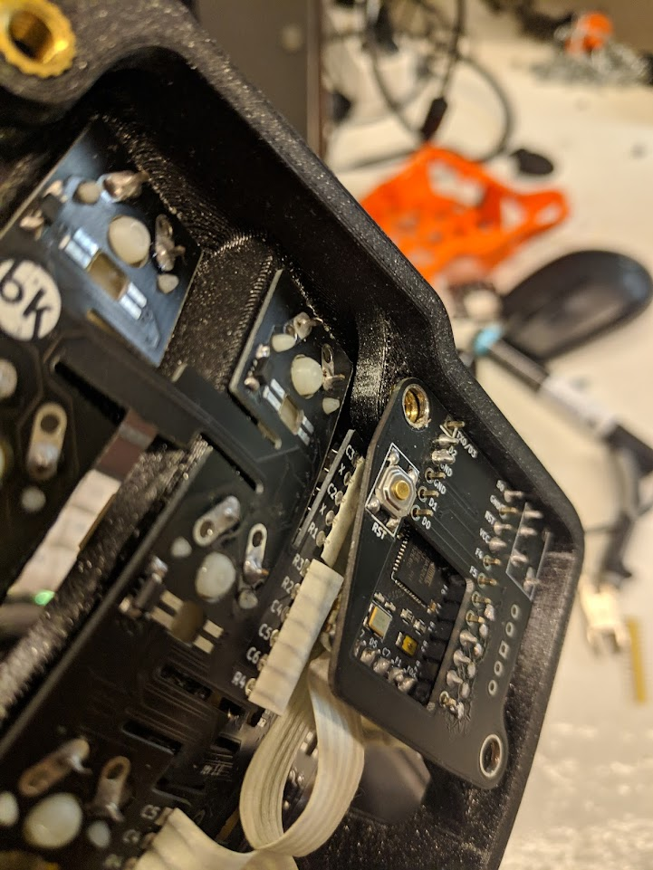

# At the time of writing (10th of Dezember 2021) this is still work in progress. There is a likelyhood of errors that have not been found yet. If you like to live on the bleeding edge go ahead if you like security wait until offical confirmation that the adapter works as intended!

Blackpill holder pcb with breakouts for rgb, trackball etc.

Licensed under CERN-OHL-W v2.

Copyright Quentin Lebastard and Stefan Kerkmann 2021.

## Pin assignments

| Pin No. | Pin  |      Function      |
| ------- | ---- | ------------------ |
| 11      | PA1  | TIM2_CH2 (RGB)     |
| 3       | PA14 | SPI1 CS TRACKBALL  |
| 10      | PA15 | SPI1 CS USER       |
| 14      | PA4  | SPI1 CS EEPROM     |
| 15      | PA5  | SPI1 SCK           |
| 16      | PA6  | SPI1 MISO          |
| 17      | PA7  | SPI1 MOSI          |
| 30      | PA9  | USART1 TX (SERIAL) |
| 32      | PA11 | USB_OTG_FS_DM      |
| 33      | PA12 | USB_OTG_FS_DP      |
| 42      | PB6  | I2C1 SCL           |
| 43      | PB7  | I2C1 SDA           |

# DMA channels

|   event   |    channel / stream     |       usage        |
| --------- | ----------------------- | ------------------ |
| I2C1_RX   | DMA1 Stream 0 Channel 1 | available          |
| I2C1_TX   | DMA1 Stream 6 Channel 1 | available          |
| SPI1_RX   | DMA2 Stream 0 Channel 3 | EEPROM and PMW3360 |
| SPI1_TX   | DMA2 Stream 3 Channel 3 | EEPROM and PMW3360 |
| TIM2_UP   | DMA1 Stream 1 Channel 3 | WS2812 PWM         |
| USART1_RX | DMA2 Stream 2 Channel 4 | not used           |
| USART1_TX | DMA2 Stream 7 Channel 4 | not used           |

## Test report

* PWM Driver - ok with external pullup and adjusted timings see `config.h`
* Serial Half-duplex - ok at default speed and up to 3.75MBit/s see `config.h`
* SPI EEPROM - ok, PWM3360 - ok from scope, should work with real hardware
* Splithand detection - ok
* Bootloader bodge - ok, can enter reliably everytime
* Matrix - ok

## BOM

| Qty. |                      Part                      |           Link        |
| ---- | ---------------------------------------------- | ----------------------|
| 2    | WeAct STM32F411 Blackpill                      | [AliExpress][1]       |
| 2    | 64Kbit STM M95 SPI EEPROM (SOP-8 package size) | [LCSC Electronics][2] |
| 10   | 5.1k 1206 Resistors                            | [LCSC Electronics][3] |
| 2    | TRRS Jack 3.5mm                                | [LCSC Electronics][4] |
| 2    | Push button 5.1mm x 1.5mm                      | [LCSC Electronics][5] |

 **Note About EEPROM:** QMK can only address 64kbit of memory. So buying anything larger is possible but wasted.

## JLCPCB Order Form (non default values)

* Different Design: 2
* PCB Height: 1mm

## Recommended way to attach MCU to adapter

[1]: <https://www.aliexpress.com/item/1005001456186625.html> "WeAct STM32F411 Blackpill"
[2]: <https://lcsc.com/product-detail/EEPROM_STMicroelectronics-M95640-WMN6TP_C140882.html> "64Kbit STM M95 SPI EEPROM (SOP-8 package size)"
[3]: <https://lcsc.com/product-detail/Chip-Resistor-Surface-Mount_UNI-ROYAL-Uniroyal-Elec-1206W4F5101T5E_C26033.html> "5.1k 1206 Resistors"
[4]: <https://lcsc.com/product-detail/Pre-ordered-Connectors_XKB-Connectivity-PJ-320E_C2884941.html> "TRRS Jack 3.5mm"
[5]: <https://lcsc.com/product-detail/Tactile-Switches_XKB-Connectivity-TS-1187A-B-A-B_C318884.html> "Push button 5.1mm x 1.5mm"
